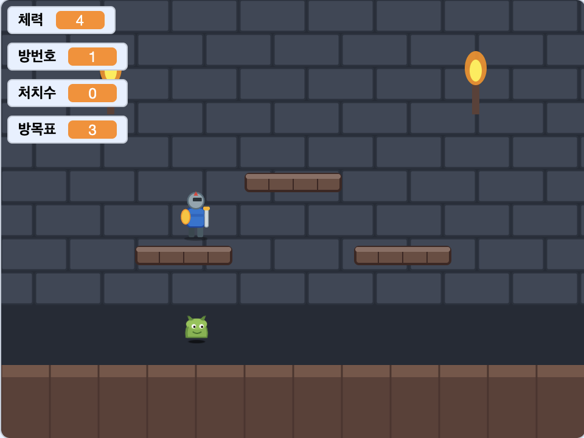
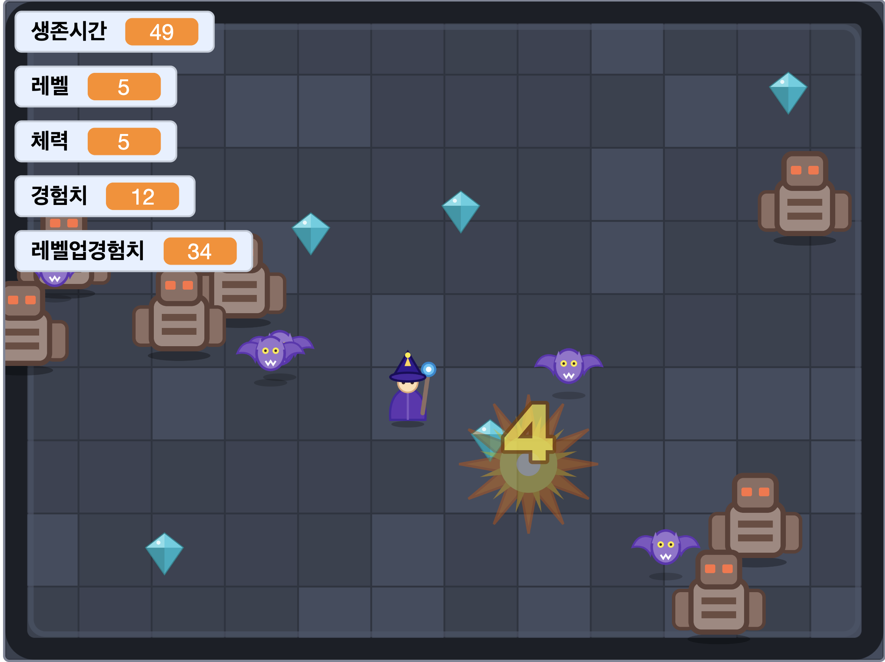
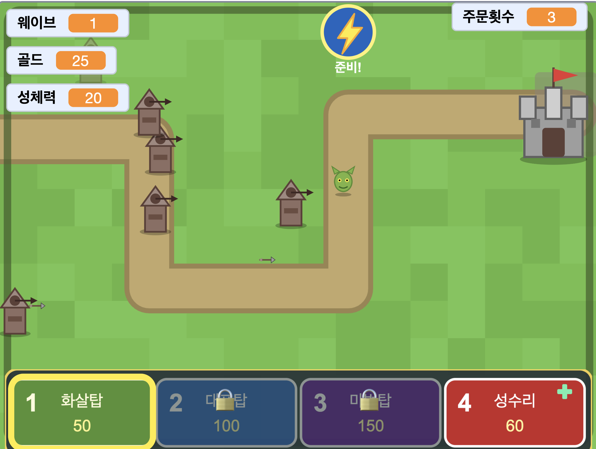

# 🎮 Scratch Games Collection

Scratch 3.0 으로 만든 학습형 미니게임 모음입니다. 코드(블록)와 함께 자동 생성 스크립트(Python)도 같이 들어 있어서, 마음대로 뜯어보거나 수정해 다시 빌드할 수 있어요.

## ✨ 추천 게임 (완성도 높은 신작)

> 아래 세 편은 **직관적인 액션 + 점점 강해지는 진행 + "한글 변수 손잡이로 직접 개조"** 를 깊게 다듬은 대표작입니다. 모든 능력치 숫자가 한글 변수로 노출돼 있어, 코드 한 줄 바꾸며 *내 게임으로* 만들 수 있어요. (스크린샷은 추후 추가 예정)

### ⚔️ [로그 나이트](games/rogue-knight/) — 액션 · 로그라이트
<!--  -->
한 화면짜리 방에 갇혀, 다가오는 적을 검으로 베어 전멸시키는 횡스크롤 로그라이트.
- 좌우 이동 · **2단 점프** · 대시 회피 · 검(Z) 공격, 적 3티어(약·중·강)
- 방을 비울 때마다 **강화 택1**(공격력/체력/속도), 맞은 자리에 **데미지 숫자 팝업**, 죽으면 처음부터
- 모든 능력치가 한글 "개조 손잡이" — 숫자만 바꿔도 게임이 확 달라짐

### 🔮 [마법 생존](games/magic-survivor/) — 액션 · 로그라이트 (뱀파이어 서바이벌형)
<!--  -->
마법사가 **자동으로 가장 가까운 적에게 마법을 쏘고**, 끝없이 몰려오는 적을 피하며 버티는 탑다운 생존.
- 화살표 8방향 이동(조준 불필요, **피하기만**) · 경험치 → 레벨업 → 강화(여러발 등)
- **적이 내 레벨에 비례해 강해짐**(밸런스), 레벨업 비용은 **피보나치**·소수 레벨 보너스(수학이 슬쩍)
- 전용 합성 효과음 + 코드 곳곳 **노란 가이드 주석**

### 🛡️ [캐슬 디펜스](games/castle-defense/) — 전략 · 타워디펜스
<!--  -->
길 따라 성으로 몰려오는 고블린·오크·트롤을, 잔디에 **포탑을 지어** 막는 로그라이트 타워디펜스.
- 마우스로 **화살·대포·마법 포탑** 배치(자동 조준 발사) · 골드 경제 · 웨이브 클리어 강화 택1 · 성수리
- ⚡ **전체 번개 궁극기**(스페이스, 게임당 3번) · 웨이브마다 적이 더 강해짐
- 43개 한글 손잡이 — 포탑·몬스터·경제·난이도를 직접 튜닝

---

## 🎯 게임 목록 (전체)

| 게임 | 주제 | 한 줄 설명 |
|------|------|-----------|
| [다항함수 발사 게임](games/polynomial-shooter/) | 수학 — 다항함수 | 계수 a, b 를 조절해 곡선을 만들고 그 곡선을 따라 로켓을 발사해 풍선을 터뜨립니다. |
| [두더지 소수잡기](games/whack-a-prime/) | 수학 — 소수 | 풀밭에서 튀어나오는 두더지의 숫자가 소수일 때만 두드려 점수 획득. 60초 제한. |
| [외계인 침공](games/alien-invasion/) | 액션 — 슈팅 | 갤러그/스페이스인베이더 스타일. 외계인 격자 격파 + 라운드 진행. |
| [미사일 커맨드](games/missile-command/) | 액션 — 슈팅 | 도시 3곳을 지키며 떨어지는 미사일을 마우스 클릭으로 요격합니다. |
| [오리 사냥](games/duck-hunt/) | 액션 — 슈팅 | 화면 위를 날아가는 오리를 십자선으로 조준 사격합니다. |
| [좀비 슈터](games/zombie-shooter/) | 액션 — 슈팅 | 화살표키로 이동 + 마우스로 좀비를 사격하며 웨이브를 버팁니다. |
| [탱크 배틀](games/tank-battle/) | 액션 — 슈팅 | 솔로 서바이벌. 끝없이 몰려오는 적 탱크를 한 방에 격파하며(처치 +1점) 엄폐물 뒤에 숨어 최대한 오래 버팁니다. |
| [로그 나이트](games/rogue-knight/) | 액션 — 로그라이트 | 횡스크롤 검사. 방을 클리어할 때마다 강화(공격력/체력/속도)를 골라 점점 강해집니다. 죽으면 처음부터. **능력치가 모두 한글 변수로 노출되어 코드를 바꾸며 놀 수 있습니다.** |
| [마법 생존](games/magic-survivor/) | 액션 — 로그라이트 | 탑다운 생존. 마법사가 자동으로 마법을 쏘고, 끝없이 몰려오는 적을 피하며 버팁니다. 레벨업마다 강화 3종 중 하나를 골라 점점 강해집니다. **24개 한글 변수 손잡이로 코드를 바꾸며 놀 수 있습니다.** |
| [캐슬 디펜스](games/castle-defense/) | 전략 — 타워디펜스 | 성/기사 vs 몬스터. 길 따라 성으로 몰려오는 고블린·오크를 마우스로 포탑(화살·대포·마법)을 배치해 막습니다. 처치하면 골드 획득 → 더 짓고, 웨이브 클리어마다 강화 택1로 점점 강하게. 성 체력 0이면 처음부터. **38개 한글 손잡이로 포탑·몬스터·경제를 바꿔볼 수 있습니다.** |
| [용사 진격전](games/hero-rush/) | 액션 — 진격 로그라이트 | 용사 1명으로 오른쪽 적 성을 향해 진격. →로 밀고 나가면 진격도가 차고 적이 웨이브로 몰려옵니다. Space/클릭=검격, X=광역 스킬(게이지), ↑=회피 점프. 진격도가 가득 차면 성문 공성 피날레 → 강화 택1로 다음 스테이지. 적은 지수(곱하기)로 세집니다. **35개 한글 손잡이 + "챕터 템포"(진격속도·스테이지길이) 튜닝으로 코드를 바꾸며 놀 수 있습니다.** |
| [풍선 슈터](games/balloon-shooter/) | 액션 — 사격 | 60초 안에 떠오르는 풍선을 마우스로 격파합니다. 작은 풍선일수록 점수가 큽니다. |
| [소행성](games/asteroids/) | 액션 — 슈팅 | 관성으로 미끄러지는 우주선을 조종해 소행성을 격파합니다. 화면 가장자리는 반대편으로 이어집니다. |
| [도그파이트](games/dogfight/) | 액션 — 슈팅 | 비행기 1대1 공중전. 회전하며 적 후방을 잡고 격추합니다. |
| [수리검 던지기](games/shuriken-throw/) | 액션 — 슈팅 | 닌자가 좌우로 이동하며 위로 수리검을 던져 표적을 격파합니다. |
| [유령 사냥](games/ghost-hunt/) | 액션 — 사격 | 어두운 방에 깜빡이는 만화풍 유령을 회중전등 십자선으로 조준 사격합니다. 60초. |
| [보스 러시](games/boss-rush/) | 액션 — 슈팅 | 1대 보스의 3페이즈 탄막을 회피하며 사격해 격파합니다. |
| [두들 점프](games/doodle-jump/) | 액션 — 점프 | 발판을 밟고 끝없이 위로 점프합니다. 발판을 놓치고 떨어지면 끝. |
| [운석 회피](games/meteor-dodge/) | 액션 — 회피 | 우주선을 조종해 화면 가득 떨어지는 운석을 피합니다. 오래 살수록 점수 ↑. |
| [헬리콥터 동굴](games/helicopter-cave/) | 액션 — 한 버튼 | 스페이스를 꾹 누르면 헬리콥터가 상승. 점점 좁아지는 동굴을 통과합니다. |
| [우주정거장 도킹](games/station-docking/) | 액션 — 정밀 조작 | 우주선을 천천히 움직여 우주정거장에 안전하게 도킹합니다. 너무 빨리 닿으면 충돌. |
| [플래피 버드](games/flappy-bird/) | 액션 — 한 버튼 | 스페이스를 누를 때마다 새가 파닥. 파이프 사이를 통과해 점수를 쌓습니다. |
| [사과 받기](games/apple-catch/) | 액션 — 캐치 | 바구니를 좌우로 움직여 떨어지는 사과를 받고 폭탄을 피합니다. |
| [엔드리스 러너](games/endless-runner/) | 액션 — 러너 | 자동으로 달리는 캐릭터. 위 = 점프, 아래 = 슬라이드로 장애물 회피. |
| [지오메트리 대시](games/geometry-dash/) | 액션 — 리듬 점프 | 자동 달리는 큐브를 스페이스 점프로 가시밭과 블록을 통과합니다. 즉사 패턴. |
| [자동차 레이싱](games/car-race/) | 액션 — 회피 | 좌/우 화살표로 차선 변경해 다가오는 차를 피합니다. 오래 살수록 점수 ↑. |
| [스네이크](games/snake/) | 액션 — 클래식 | 화살표키로 뱀을 조종해 사과를 먹으면 꼬리가 자랍니다. 벽과 자기 몸에 부딪히면 끝. |
| [핑퐁](games/pong/) | 액션 — 클래식 | 위/아래 화살표로 패들을 움직여 공을 받아칩니다. AI 상대로 먼저 5점 내면 승리. |
| [벽돌깨기](games/breakout/) | 액션 — 클래식 | 패들로 공을 받아쳐 위쪽 벽돌 32개를 격파합니다. 다 깨면 더 빨라진 다음 라운드. |
| [테트리스 미니](games/tetris-mini/) | 액션 — 클래식 | 7가지 블록을 회전·이동시켜 줄을 채워 제거합니다. 8×14 간소화 보드, 레벨업마다 빨라짐. |
| [팩맨 미니](games/pacman-mini/) | 액션 — 클래식 | 미로 속 도트 92개를 모두 먹으면 승리. 유령 4마리 회피, 파워펠릿으로 역습. |
| [버블 슈터](games/bubble-shooter/) | 액션 — 퍼즐 슈팅 | 마우스로 조준해 색 거품을 발사, 같은 색 3개 이상 모으면 터집니다. 5발마다 한 줄 압박. |
| [카우보이 결투](games/cowboy-duel/) | 액션 — 반응속도 | "DRAW!" 신호에 스페이스를 먼저 누르면 승리. 신호 전에 누르면 반칙 패. 5판 3선승. |
| [골드 마이너](games/gold-miner/) | 액션 — 타이밍 | 진자처럼 흔들리는 후크를 타이밍 맞춰 발사해 금괴·다이아를 끌어올립니다. 60초 안에 목표 점수 달성. |
| [종이비행기 멀리 던지기](games/paper-plane/) | 액션 — 발사 | 각도·힘 게이지를 타이밍 맞춰 멈추고 종이비행기를 던집니다. 순풍/역풍 속 3번 던져 합계 거리 경쟁. |
| [풍선 펌프](games/balloon-pump/) | 액션 — 배짱 | 스페이스를 꾹 눌러 풍선을 불어요. 크게 불수록 점수 가속, 터지면 0점. 5라운드 합계 경쟁. |

> 📝 **2026-05-18 정리**: 이전에 있던 「지수·로그」 단원 9개 게임(박테리아 디펜스, 지수함수 슈터, 비트 탭, 데시벨 DJ, 옥타브 피아노, 반감기 광산, 복리 카드, pH 적정, 리히터 진앙)은 *초등학생 대상으로는 너무 학구적이고 노잼* 이라는 피드백으로 전부 삭제했습니다. 다음 배치는 **슈팅·로켓·러너 같은 직관적 액션 게임** 위주로 갑니다. 후보 목록은 [`docs/game-candidates.md`](docs/game-candidates.md) 참고.
>
> 복리 카드 게임의 메커닉은 재미있어 [별도 웹게임 디자인 문서](docs/web-game-compound-cards.md)로 보존했습니다 (Scratch 외부 별도 프로젝트로 추후 구현 예정).

## 🚀 게임 실행 방법

1. 원하는 게임 폴더에 들어가서 `.sb3` 파일을 다운로드합니다.
2. [scratch.mit.edu](https://scratch.mit.edu) 에 접속해 **만들기** 클릭.
3. 상단 메뉴 → **파일 → 컴퓨터에서 가져오기** → 받은 `.sb3` 선택.
4. 초록 깃발(▶) 클릭으로 시작.

오프라인 에디터([Scratch Desktop](https://scratch.mit.edu/download))에서도 동일하게 열 수 있습니다.

## 🛠 게임 다시 빌드하기

각 게임 폴더에는 `build.py` 가 들어 있습니다. 스프라이트 SVG, 사운드, 블록 코드까지 전부 코드로 정의되어 있어서, 값만 바꾸고 다시 돌리면 새 `.sb3` 가 만들어집니다.

```bash
cd games/polynomial-shooter
python3 build.py
# → 다항함수_게임.sb3 가 갱신됨
```

Python 3.x 만 있으면 외부 라이브러리 없이 돕니다.

## 📂 레포 구조

```
scratch-games-collection/
├── README.md                 ← 이 파일 (게임 모음 소개)
└── games/
    └── polynomial-shooter/   ← 게임 한 개당 폴더 하나
        ├── README.md         ← 게임 설명서
        ├── 다항함수_게임.sb3   ← 바로 플레이 가능한 빌드 결과
        ├── build.py          ← 자동 생성 스크립트
        └── assets/           ← 스프라이트/사운드 원본
```

## ➕ 새 게임 추가하기

1. `games/<game-name>/` 폴더 생성
2. 게임 파일들과 README 작성
3. 위 게임 목록 표에 한 줄 추가

> 💡 **다음에 만들 게임 후보 모음**: [`docs/game-candidates.md`](docs/game-candidates.md) — 클래식 아케이드 / 학습형 / 두뇌 퍼즐 / 액션 등 카테고리별로 정리되어 있습니다.

## 📜 라이선스

코드(`build.py`, README): MIT
스프라이트 일부(🚀 🎈)는 [Twemoji](https://github.com/jdecked/twemoji) 사용 (CC-BY 4.0).
