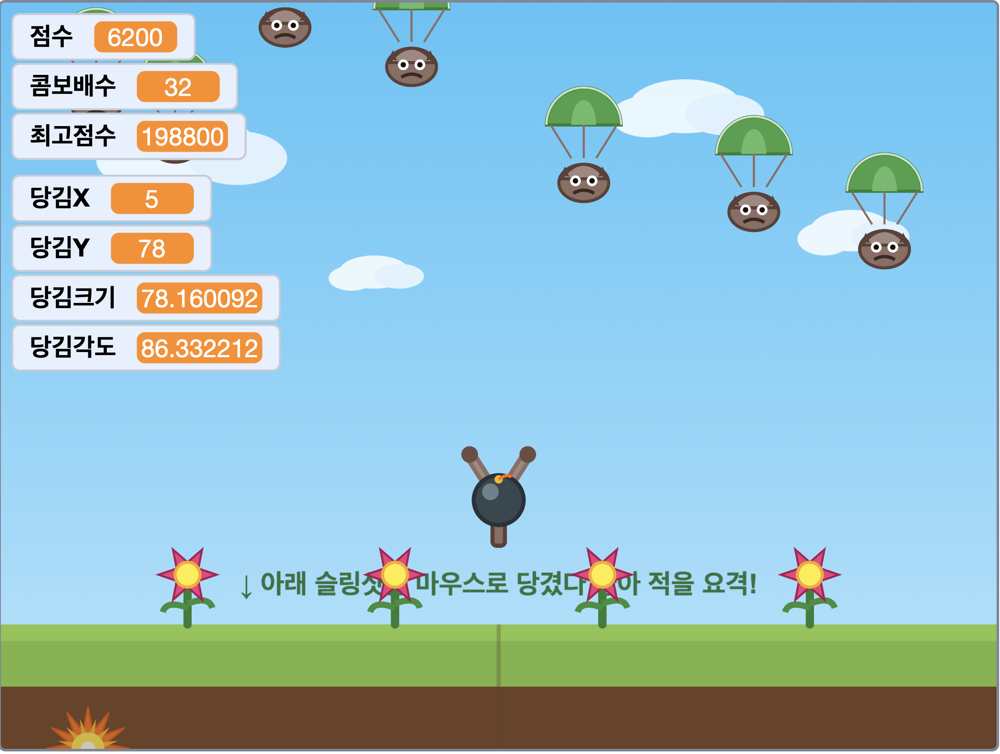
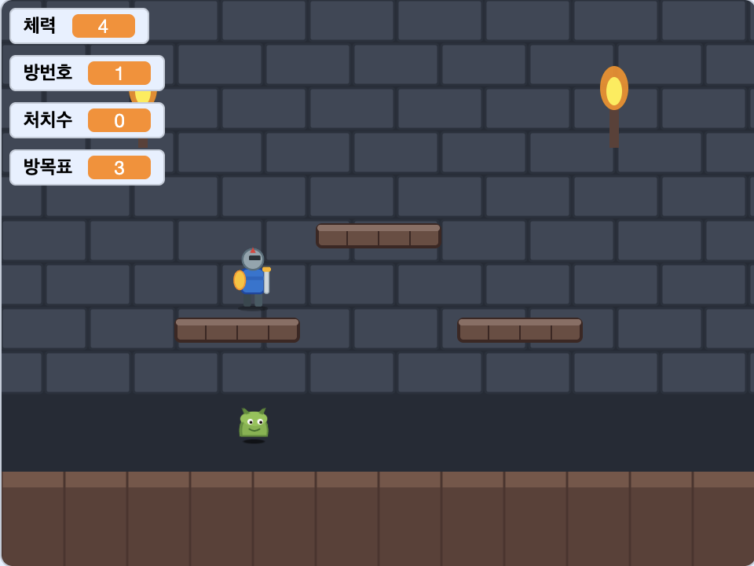
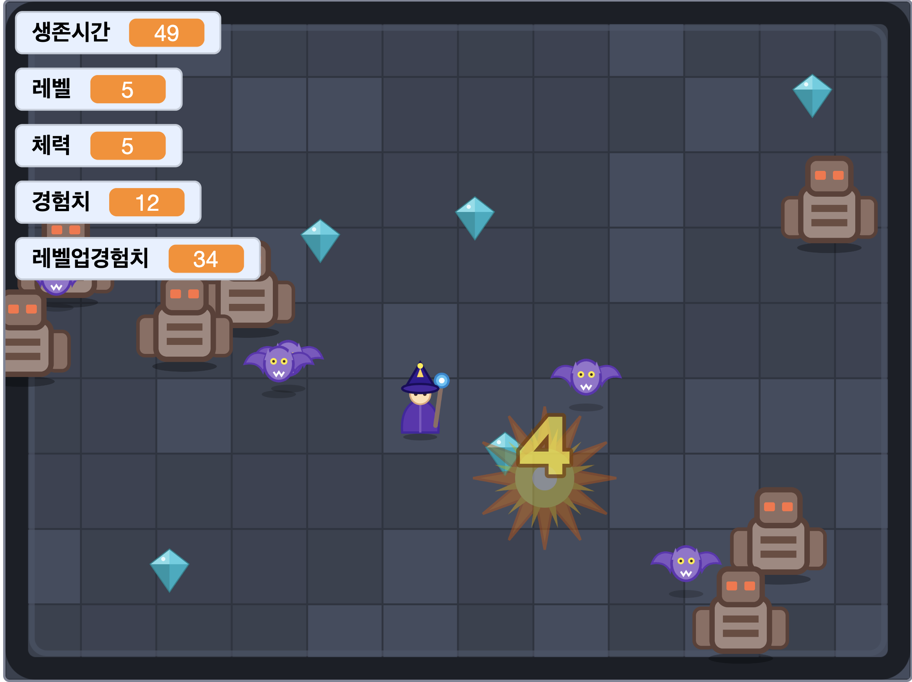
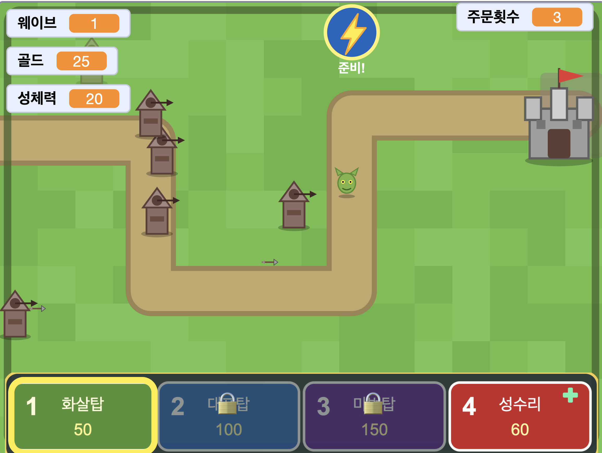
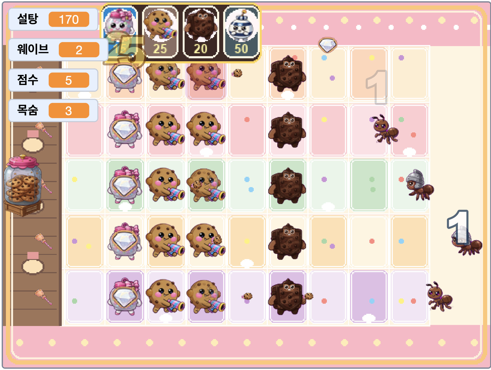
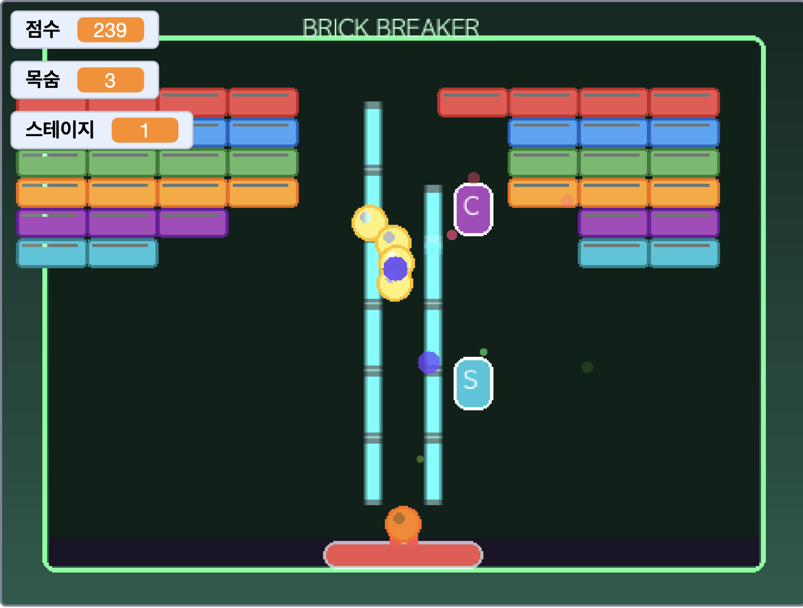
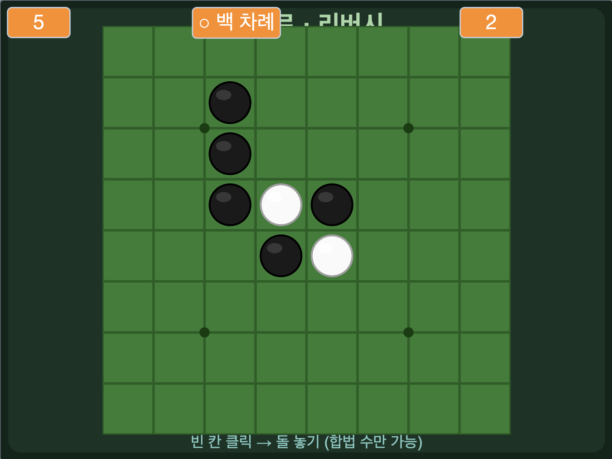
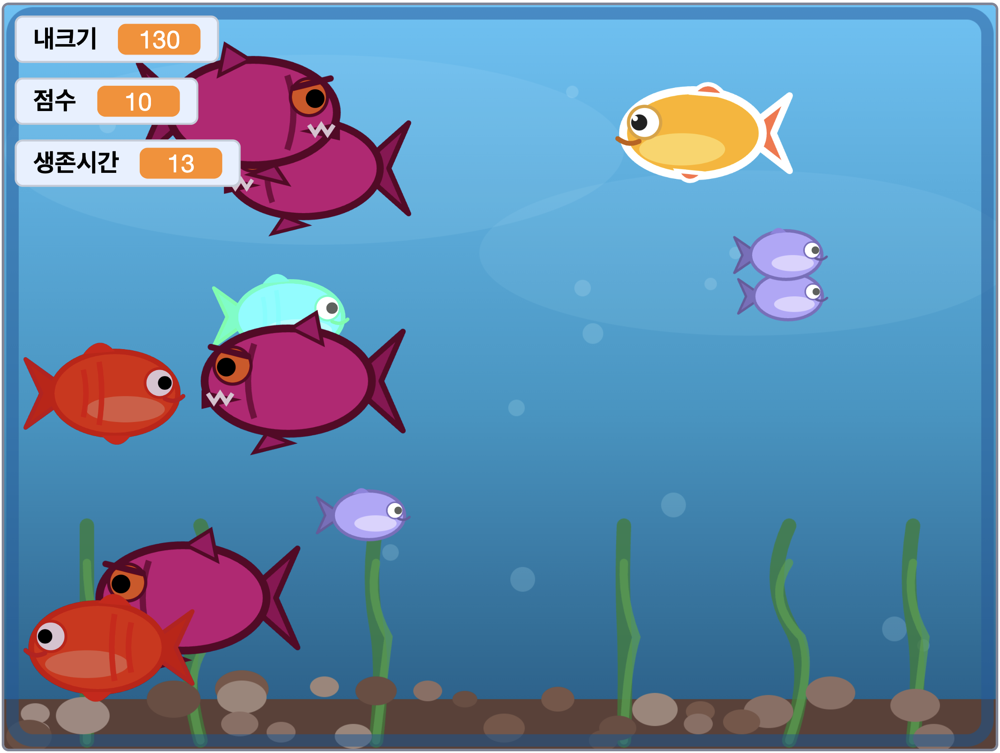
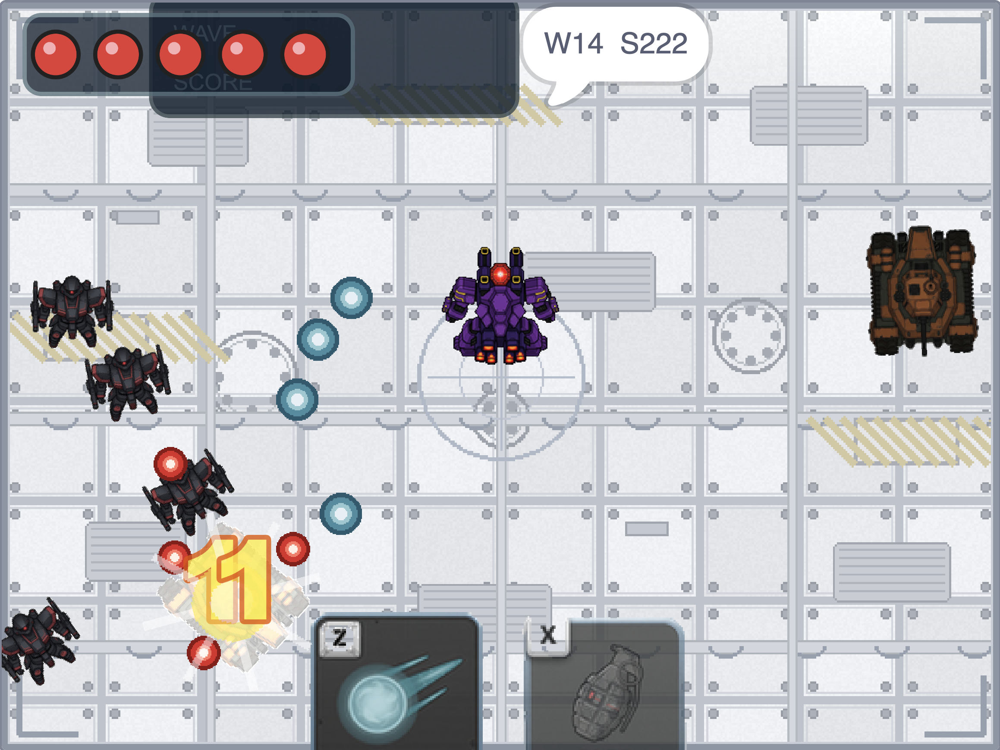
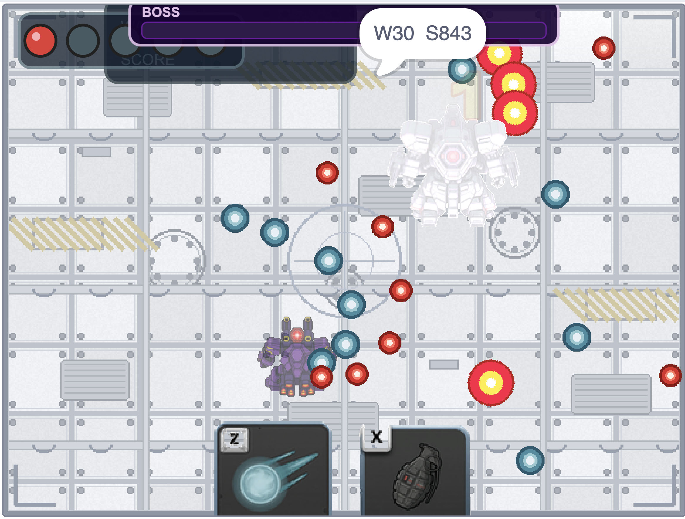

# 🎮 Scratch Games Collection

Scratch 3.0 으로 만든 학습형 미니게임 모음입니다. 코드(블록)와 함께 자동 생성 스크립트(Python)도 같이 들어 있어서, 마음대로 뜯어보거나 수정해 다시 빌드할 수 있어요.

## ✨ 추천 게임 (완성도 높은 신작)

> 아래 게임들은 **직관적인 액션 + 점점 강해지는 진행 + "한글 변수 핸들로 직접 개조"** 를 깊게 다듬은 대표작입니다. 모든 능력치 숫자가 한글 변수로 노출돼 있어, 코드 한 줄 바꾸며 *내 게임으로* 만들 수 있어요.

### 💣 [폭탄 스쿼드](games/bomb-squad/) — 액션 · 방어 (밥옴 스쿼드형)


하단 슬링샷을 마우스로 **당겨서 놓아** 포탄을 포물선으로 쏴, 낙하산 타고 내려오는 적 몬스터를 요격해 꽃밭을 지키는 엔들리스 방어.
- **드래그 조준** + 점선 궤적 미리보기(실제 포탄과 같은 물리) · **여러 발 연사** · **관통샷**
- 연속 명중 **콤보 배증** · 라키투 맞히면 화면 전멸 보너스 · 갈수록 빨라지는 난이도 · 전용 BGM
- 24개 한글 핸들 — 특히 **`중력` 하나로 직선 슬링샷 ↔ 활 로빙**을 오갑니다

### ⚔️ [로그 나이트](games/rogue-knight/) — 액션 · 로그라이트


한 화면짜리 방에 갇혀, 다가오는 적을 검으로 베어 전멸시키는 횡스크롤 로그라이트.
- 좌우 이동 · **2단 점프** · 대시 회피 · 검(Z) 공격, 적 3티어(약·중·강)
- 방을 비울 때마다 **강화 택1**(공격력/체력/속도), 맞은 자리에 **데미지 숫자 팝업**, 죽으면 처음부터
- 모든 능력치가 한글 "개조 핸들" — 숫자만 바꿔도 게임이 확 달라짐

### 🔮 [마법 생존](games/magic-survivor/) — 액션 · 로그라이트 (뱀파이어 서바이벌형)


마법사가 **자동으로 가장 가까운 적에게 마법을 쏘고**, 끝없이 몰려오는 적을 피하며 버티는 탑다운 생존.
- 화살표 8방향 이동(조준 불필요, **피하기만**) · 경험치 → 레벨업 → 강화(여러발 등)
- **적이 내 레벨에 비례해 강해짐**(밸런스), 레벨업 비용은 **피보나치**·소수 레벨 보너스(수학이 슬쩍)
- 전용 합성 효과음 + 코드 곳곳 **노란 가이드 주석**

### 🛡️ [캐슬 디펜스](games/castle-defense/) — 전략 · 타워디펜스


길 따라 성으로 몰려오는 고블린·오크·트롤을, 잔디에 **포탑을 지어** 막는 로그라이트 타워디펜스.
- 마우스로 **화살·대포·마법 포탑** 배치(자동 조준 발사) · 골드 경제 · 웨이브 클리어 강화 택1 · 성수리
- ⚡ **전체 번개 궁극기**(스페이스, 게임당 3번) · 웨이브마다 적이 더 강해짐
- 43개 한글 핸들 — 포탑·몬스터·경제·난이도를 직접 튜닝

### 🍪 [쿠키 대 개미](games/cookies-vs-ants/) — 액션 · 레인 타워디펜스


공장 **5레인 × 9칸 그리드**에 장치를 설치해, 오른쪽에서 기어오는 귀여운 만화 개미를 막는 쿠키 공장 디펜스.
- 설탕 경제(설탕기계 + 하늘 낙하) · 메뉴판 클릭 설치 · **쿠키캐논** 자동 발사 · **초코벽** · **밀크폭탄**
- 레인당 1회 **빗자루** 구원 · 웨이브 스케일(헬멧·빠른 개미·보스 개미) · 목숨 0이면 GAME OVER
- **50개 한글 핸들** — 가격·체력·발사 간격·개미 속도·그리드 크기까지 전부 튜닝 가능

### 🧱 [벽돌깨기](games/brick-breaker/) — 액션 · 브릭 브레이커


패들로 공을 받아 위쪽 벽돌을 깨는 Arkanoid / DX-Ball 감성 파워업 벽돌깨기.
- **멀티볼·확대·레이저·캐치·관통·감속** 파워업 드롭 · 단단/폭발 벽돌
- 시간이 갈수록 **카오스**(자동 멀티볼 웨이브·레이저 광란·공속 상승) · 전용 BGM
- 스테이지 5종 패턴, 클리어 시 다음 스테이지 → 전부 깨면 1부터 풀 리셋
- 핸들: `공속도` · `아이템확률` · `멀티볼최대` · `브금볼륨` 등

### ⚫ [오델로 (리버시)](games/othello/) — 두뇌 · 보드게임


8×8 보드에서 **흑 vs 백** 2인 대국. 빈 칸을 클릭해 돌을 놓으면 8방향으로 끼인 상대 돌이 뒤집힙니다.
- **합법 수만** 둘 수 있음 · 둘 곳 없으면 자동 패스 · 양쪽 모두 불능이면 돌 수로 승패
- 점수(흑/백) · 차례 안내 모니터 · 클릭 한 번에 수 계산·뒤집기

### 🐟 [어항 포식자](games/fish-tank/) — 액션 · 성장 (피딩 프렌지형)


방향키로 물고기를 조종해, 자유롭게 헤엄치는 다른 물고기 중 **나보다 작은 것만 골라 먹어** 끝없이 커지는 엔들리스 성장 액션.
- 큰 물고기(붉은빛)에 닿으면 잡아먹혀 끝 — **생존시간·크기 기록**에 도전
- 14개 한글 핸들(성장량·먹기기준·속도·스폰 등)로 성장 곡선을 직접 튜닝

### 🤖 [로봇 슈터](games/robot-shooter/) — 액션 · 탑뷰 자동 미사일
 

탑뷰 아레나에서 **자동 미사일 + 레이저 + 투척 폭탄**으로 적 모빌슈트를 쓸어 담는 웨이브 슈터.
- ←→↑↓ 이동 · **Z 레이저스킬 / X 폭탄 투척**(날아가 펑!) · 스킬 아이콘 쿨 UI · 체력 하트
- 웨이브 클리어 **랜덤 강화 3택1** · 변수 모니터 없이 UI 표시 · 데미지 숫자·폭발 연출

### 🌴 [정글 디펜스](games/jungle-defense/) — 전략 · 길 타워디펜스 (캐슬 리테마)
캐슬 디펜스와 **같은 길·포탑·웨이브·강화** 뼈대에, Kingdom Rush 감성 **정글 부족 오두막** 에셋을 씌운 신작.
- S자 오솔길을 따라 청전사·방패병·거인이 마을 거점으로 행진
- **창오두막 / 북오두막 / 토템탑** 자동 사격 · 골드 · 웨이브 클리어 강화 택1 · 번개 궁극기
- 핸들은 캐슬과 동일(화살탑_/고블린_ 등 변수명 유지) — 숫자만 바꿔 밸런스 실험

### 💥 [지아이조](games/gi-joe/) — 액션 · 탱크 곡사
옆보기 **탱크 곡사**. ←→ 이동 · ↑↓ 각도 · **space 차지 발사**(짧게=약, 길게=강) · X 수류탄.
- 한 칸 상자는 딛고 올라가고, 두 칸 벽은 각도로 넘긴다. 착탄 범위 폭발.
- 배경 6장 사이클: 사막·협곡·밤·폭풍·초원, **6번째는 대형 전차 보스전**. 엔드리스.
- 전용 BGM(철갑 탱크) · 파워 게이지 · 한글 핸들(`파워배율` · `웨이브킬` · `보스기본체력` 등)

### 🏛️ [트로이 디펜스](games/troy-defense/) — 전략 · 트로이 공방전
**놀란 오디세이 개봉 기념** — 그리스 군세를 막는 트로이 성벽 수비 타워디펜스.
- 공성로를 따라 **경보병·호플리테스·영웅**이 성채로 돌진
- **궁수대 / 발리스타 / 성화소** · 랜덤 강화 · **아폴론·아레스**(클릭 조준 범위) + **아르테미스**(전역 3회) PNG 스킬
- 성벽 게이지·WAVE HUD · 골드는 변수 모니터

---

## 🎯 게임 목록 (전체)

| 게임 | 주제 | 한 줄 설명 |
|------|------|-----------|
| [지아이조](games/gi-joe/) | 액션 — 탱크 곡사 | 옆보기 곡사포. space 차지 발사, 착탄 폭발. 5맵+6번째 보스전 엔드리스 사이클. |
| [로봇 슈터](games/robot-shooter/) | 액션 — 탑뷰 자동 미사일 | 자동 미사일·레이저, X 폭탄 투척(펑!), Z 레이저스킬. 스킬 아이콘 쿨·체력 하트 UI. 랜덤 강화 3택1. |
| [로그 나이트](games/rogue-knight/) | 액션 — 로그라이트 | 횡스크롤 검사. 방을 클리어할 때마다 강화(공격력/체력/속도)를 골라 점점 강해집니다. 죽으면 처음부터. **능력치가 모두 한글 변수로 노출되어 코드를 바꾸며 놀 수 있습니다.** |
| [마법 생존](games/magic-survivor/) | 액션 — 로그라이트 | 탑다운 생존. 마법사가 자동으로 마법을 쏘고, 끝없이 몰려오는 적을 피하며 버팁니다. 레벨업마다 강화 3종 중 하나를 골라 점점 강해집니다. **24개 한글 변수 핸들로 코드를 바꾸며 놀 수 있습니다.** |
| [어항 포식자](games/fish-tank/) | 액션 — 성장 (피딩 프렌지형) | 방향키로 물고기를 조종해, 자유롭게 헤엄치는 다른 물고기 중 **나보다 작은 것(초록빛)만 골라 먹어** 끝없이 커집니다. 큰 것(붉은빛)에 닿으면 잡아먹혀 끝 — 얼마나 오래·크게 버티나 **생존시간·크기 기록에 도전**하는 엔들리스. **14개 한글 핸들(성장량·먹기기준·속도·스폰 등)로 코드를 바꾸며 놀 수 있습니다.** |
| [캐슬 디펜스](games/castle-defense/) | 전략 — 타워디펜스 | 성/기사 vs 몬스터. 길 따라 성으로 몰려오는 고블린·오크를 마우스로 포탑(화살·대포·마법)을 배치해 막습니다. 처치하면 골드 획득 → 더 짓고, 웨이브 클리어마다 강화 택1로 점점 강하게. 성 체력 0이면 처음부터. **38개 한글 핸들로 포탑·몬스터·경제를 바꿔볼 수 있습니다.** |
| [정글 디펜스](games/jungle-defense/) | 전략 — 길 타워디펜스 | 캐슬 디펜스 리테마. 정글 오솔길 + 부족 오두막 포탑(창/북/토템) + 청전사 웨이브. 조작·경제·강화 루프 동일. |
| [트로이 디펜스](games/troy-defense/) | 전략 — 트로이 공방전 | 놀란 오디세이 기념. 트로이 성벽 수비. 궁수대·발리스타·성화소 vs 그리스군. 아폴론/아레스 클릭조준 + 아르테미스 전역. |
| [쿠키 대 개미](games/cookies-vs-ants/) | 액션 — 레인 타워디펜스 | 5레인×9칸 그리드에 설탕기계·쿠키캐논·초코벽·밀크폭탄을 설치해 개미 웨이브를 막습니다. 설탕 경제 + 레인당 빗자루 1회 + 보스 개미. **50개 한글 핸들**. |
| [폭탄 스쿼드](games/bomb-squad/) | 액션 — 방어 (밥옴 스쿼드형) | 하단 슬링샷을 마우스로 **당겨서 놓아** 포탄을 포물선으로 쏴, 하늘에서 낙하산 타고 내려오는 **적 몬스터**를 요격합니다. 바닥 꽃밭(꽃=라이프)에 적이 닿으면 꽃이 부서지고, 다 부서지면 끝. **여러 발 연사** + **관통샷**(한 발이 여러 적 꿰뚫기) + 연속 명중 **콤보 배증** + 라키투 맞히면 화면 전멸 보너스 + 갈수록 빨라지는 난이도 — 얼마나 오래·높이 버티나 도전하는 엔들리스. 전용 BGM 탑재. **24개 한글 핸들(발사력·중력·낙하속도·관통횟수·최대포탄수·콤보·브금볼륨 등) — 특히 `중력` 하나로 직선 슬링샷↔활 로빙을 오갑니다.** |
| [스네이크](games/snake/) | 액션 — 클래식 | 화살표키로 뱀을 조종해 사과를 먹으면 꼬리가 자랍니다. 벽과 자기 몸에 부딪히면 끝. |
| [오델로 (리버시)](games/othello/) | 두뇌 — 보드게임 | 흑● vs 백○ 2인 대국. 빈 칸 클릭으로 합법 수만 두고 8방향 뒤집기. 패스·돌 수 승패. |
| [벽돌깨기](games/brick-breaker/) | 액션 — 브릭 브레이커 | 패들+공으로 벽돌 격파. 파워업 6종, 카오스 연출, BGM, 5스테이지 루프. |


## 🚀 게임 실행 방법

1. 원하는 게임 폴더에 들어가서 `.sb3` 파일을 다운로드합니다.
2. [scratch.mit.edu](https://scratch.mit.edu) 에 접속해 **만들기** 클릭.
3. 상단 메뉴 → **파일 → 컴퓨터에서 가져오기** → 받은 `.sb3` 선택.
4. 초록 깃발(▶) 클릭으로 시작.

오프라인 에디터([Scratch Desktop](https://scratch.mit.edu/download))에서도 동일하게 열 수 있습니다.

## 🛠 게임 다시 빌드하기

각 게임 폴더에는 `build.py` 가 들어 있습니다. 스프라이트 SVG, 사운드, 블록 코드까지 전부 코드로 정의되어 있어서, 값만 바꾸고 다시 돌리면 새 `.sb3` 가 만들어집니다.

```bash
cd games/fish-tank
python3 build.py
# → 어항_포식자.sb3 가 갱신됨
```

Python 3.x 만 있으면 외부 라이브러리 없이 돕니다.

## 📂 레포 구조

```
scratch-games-collection/
├── README.md            ← 이 파일 (게임 모음 소개)
├── docs/
│   ├── lessons.md       ← 제작 교훈 (장르·아키텍처·폐기 판단)
│   ├── game-candidates.md
│   └── games-queue.md
└── games/
    └── fish-tank/       ← 게임 한 개당 폴더 하나
        ├── README.md    ← 게임 설명서
        ├── 어항_포식자.sb3 ← 바로 플레이 가능한 빌드 결과
        ├── build.py     ← 자동 생성 스크립트
        └── assets/      ← 스프라이트/사운드 원본
```

## ➕ 새 게임 추가하기

1. `games/<game-name>/` 폴더 생성
2. 게임 파일들과 README 작성
3. 위 게임 목록 표에 한 줄 추가

> 💡 **다음에 만들 게임 후보 모음**: [`docs/game-candidates.md`](docs/game-candidates.md) — 클래식 아케이드 / 학습형 / 두뇌 퍼즐 / 액션 등 카테고리별로 정리되어 있습니다.  
> 📓 **제작 교훈**: [`docs/lessons.md`](docs/lessons.md) — Scratch에 맞는 장르, 성능·합체 버그, 폐기 기준 등 (수박 게임 실험 포함).

## 📜 라이선스

코드(`build.py`, README): MIT
스프라이트 일부(🚀 🎈)는 [Twemoji](https://github.com/jdecked/twemoji) 사용 (CC-BY 4.0).
